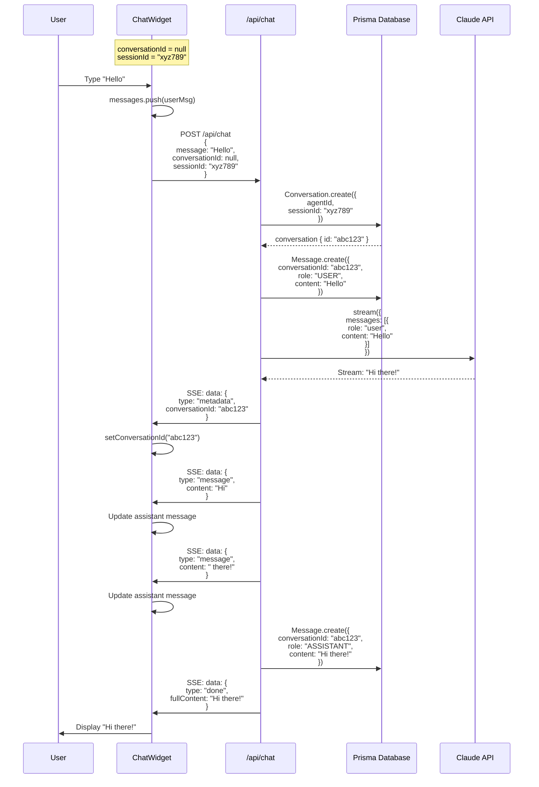
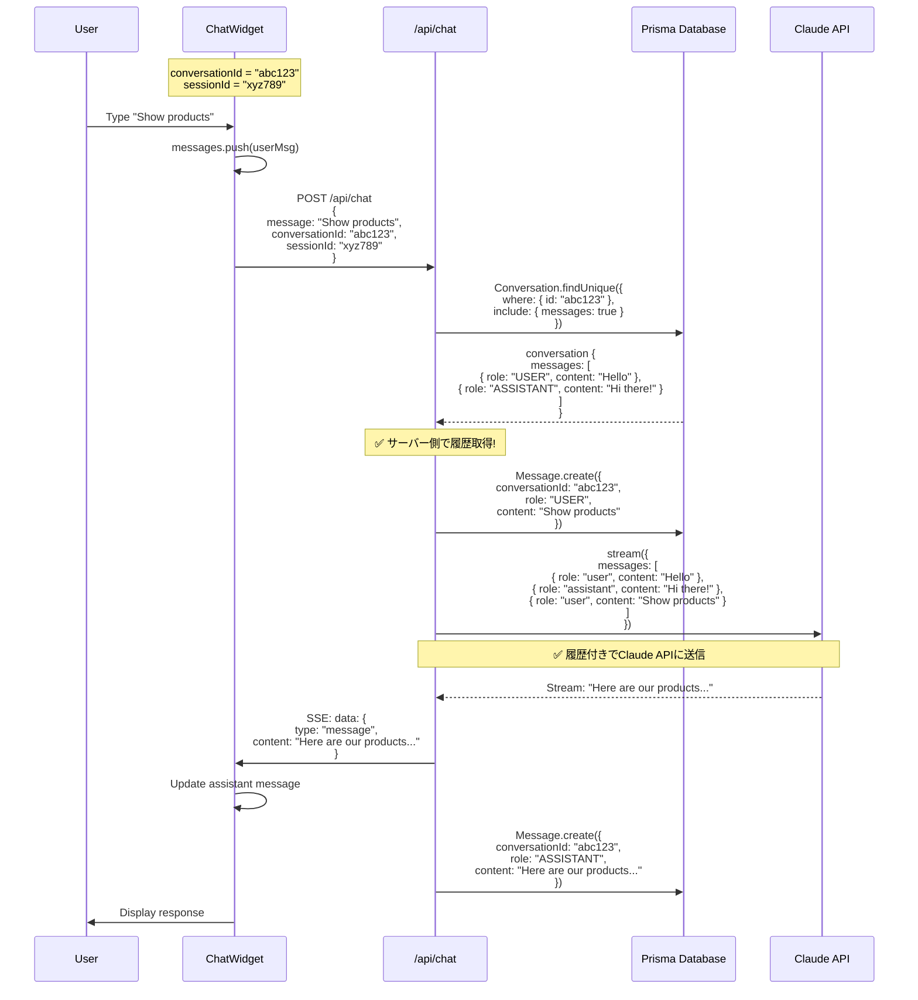

# Chat Widget API Payload最適化 - データフロー図

## Before vs After 比較

### ❌ Before (非効率)

```
┌──────────────────────────────────────────────────────────────────┐
│ Widget State                                                      │
│                                                                   │
│ messages = [                                                      │
│   { role: "assistant", content: "Welcome!" },                    │
│   { role: "user", content: "Hello" },                            │
│   { role: "assistant", content: "Hi there!" },                   │
│   { role: "user", content: "Show me products" },                 │
│   { role: "assistant", content: "Here are..." },                 │
│   ... (100 messages = 50KB+)                                     │
│ ]                                                                 │
└──────────────────────────────────────────────────────────────────┘
                    │
                    │ fetch("/api/chat", {
                    │   body: JSON.stringify({
                    │     agentId: "xxx",
                    │     messages: [...全履歴...] ← ❌ 50KB+
                    │   })
                    │ })
                    ▼
┌──────────────────────────────────────────────────────────────────┐
│ API Server (route.ts)                                            │
│                                                                   │
│ - Receive 50KB+ payload                                          │
│ - Parse all messages                                             │
│ - Send to Claude API (Token limit risk)                          │
│ - Save response to DB                                            │
└──────────────────────────────────────────────────────────────────┘
```

### ✅ After (最適化済み)

```
┌──────────────────────────────────────────────────────────────────┐
│ Widget State                                                      │
│                                                                   │
│ messages = [...] (UI表示用のみ)                                    │
│ conversationId = "abc123" ← ✅ サーバー側の会話ID参照              │
│ sessionId = "xyz789"      ← ✅ クライアント識別                    │
└──────────────────────────────────────────────────────────────────┘
                    │
                    │ fetch("/api/chat", {
                    │   body: JSON.stringify({
                    │     agentId: "xxx",
                    │     message: "New message", ← ✅ 0.5KB のみ
                    │     conversationId: "abc123",
                    │     sessionId: "xyz789"
                    │   })
                    │ })
                    ▼
┌──────────────────────────────────────────────────────────────────┐
│ API Server (route.ts)                                            │
│                                                                   │
│ - Receive 0.5KB payload (100倍削減!)                              │
│ - Fetch history from DB: conversation.messages ← ✅ サーバー側管理 │
│ - Send to Claude API (Token最適化)                                │
│ - Save new message to DB                                          │
└──────────────────────────────────────────────────────────────────┘
```

---

## シーケンス図: 初回メッセージ



---

## シーケンス図: 2回目以降のメッセージ



---

## データベーススキーマ連携

```
┌─────────────────────────────────────────────────────────────┐
│ Conversation                                                │
├─────────────────────────────────────────────────────────────┤
│ id          : "abc123" ← conversationId                     │
│ sessionId   : "xyz789" ← クライアント識別                     │
│ agentId     : "agent-001"                                   │
│ status      : "ACTIVE"                                      │
│ createdAt   : 2025-12-11T10:00:00Z                          │
│ updatedAt   : 2025-12-11T10:05:00Z                          │
└─────────────────────────────────────────────────────────────┘
                    │
                    │ has many
                    ▼
┌─────────────────────────────────────────────────────────────┐
│ Message[]                                                   │
├─────────────────────────────────────────────────────────────┤
│ { id: "m1", role: "USER",      content: "Hello" }          │
│ { id: "m2", role: "ASSISTANT", content: "Hi there!" }      │
│ { id: "m3", role: "USER",      content: "Show products" }  │
│ { id: "m4", role: "ASSISTANT", content: "Here are..." }    │
│ ...                                                          │
│ (100 messages stored in DB, not in Widget state)           │
└─────────────────────────────────────────────────────────────┘
```

---

## State管理の変化

### Before (全履歴保持)
```typescript
// Widget State
const [messages, setMessages] = useState<Message[]>([
  { id: "1", role: "assistant", content: "Welcome!" },
  { id: "2", role: "user", content: "Hello" },
  { id: "3", role: "assistant", content: "Hi there!" },
  // ... 100 messages → Heavy memory usage
]);

// API呼び出し
fetch("/api/chat", {
  body: JSON.stringify({
    agentId,
    messages: messages.map(m => ({  // ❌ 全履歴送信
      role: m.role,
      content: m.content
    }))
  })
});
```

### After (ID参照)
```typescript
// Widget State
const [messages, setMessages] = useState<Message[]>([...]);  // UI表示用のみ
const [conversationId, setConversationId] = useState<string | null>(null);
const [sessionId] = useState(() => crypto.randomUUID());

// API呼び出し
fetch("/api/chat", {
  body: JSON.stringify({
    agentId,
    message: userMessage.content,  // ✅ 新規メッセージのみ
    conversationId,                 // ✅ DB参照用ID
    sessionId                       // ✅ セッション識別
  })
});

// Server Side (route.ts)
const conversation = await prisma.conversation.findUnique({
  where: { id: conversationId },
  include: { messages: { orderBy: { createdAt: "asc" } } }  // ✅ DBから履歴取得
});
```

---

## パフォーマンス比較

### メッセージ数とペイロードサイズ

```
Payload Size (KB)
    ▲
100 │                                   ❌ Before
    │                                  /
 80 │                                 /
    │                                /
 60 │                               /
    │                              /
 40 │                             /
    │                            /
 20 │                           /
    │                          /
  0 │ ────────────────────────────────── ✅ After (常に0.5KB)
    └──────────────────────────────────────────────────────────▶
    0    20    40    60    80   100  Messages Sent
```

### 具体的な数値

| Messages | Before (KB) | After (KB) | 削減率 |
|----------|-------------|------------|--------|
| 1        | 0.5         | 0.5        | 0%     |
| 10       | 5.0         | 0.5        | 90%    |
| 50       | 25.0        | 0.5        | 98%    |
| 100      | 50.0        | 0.5        | 99%    |
| 1000     | 500.0       | 0.5        | 99.9%  |

---

## エラーハンドリング

### conversationId不正時
```
Widget → API: conversationId = "invalid-id"
    │
    ▼
API → DB: prisma.conversation.findUnique({ where: { id: "invalid-id" } })
    │
    ▼
DB → API: null (見つからない)
    │
    ▼
API: フォールバック → 新規Conversation作成
    │
    ▼
API → Widget: 新しいconversationId返却
```

### ネットワークエラー時
```
Widget → API: (Network failure)
    │
    ▼
catch (error) {
  setMessages([...prev, {
    role: "assistant",
    content: "申し訳ございません。エラーが発生しました。"
  }]);
}
```

---

## セキュリティフロー

### conversationId検証
```
┌─────────────────────────────────────────────────────────────┐
│ Client (Widget)                                             │
│ conversationId = "user-provided-id"                         │
└─────────────────────────────────────────────────────────────┘
                    │
                    ▼ POST /api/chat
┌─────────────────────────────────────────────────────────────┐
│ Server (route.ts)                                           │
│                                                              │
│ 1. ✅ DB検証: prisma.conversation.findUnique()              │
│    - 存在しない → 新規作成                                   │
│    - 存在する → 履歴取得                                     │
│                                                              │
│ 2. ✅ agentId検証: conversation.agentId === req.agentId     │
│    - 一致しない → 403 Forbidden                             │
│                                                              │
│ 3. ✅ sessionId検証: 追加推奨 (オプション)                   │
│    - conversation.sessionId === req.sessionId               │
└─────────────────────────────────────────────────────────────┘
```

---

## 将来の拡張

### 会話履歴復元 (ページリロード後)
```typescript
// localStorage保存
useEffect(() => {
  if (conversationId) {
    localStorage.setItem(`chat_${agentId}`, conversationId);
  }
}, [conversationId, agentId]);

// 復元
useEffect(() => {
  const savedId = localStorage.getItem(`chat_${agentId}`);
  if (savedId) {
    // API経由で履歴取得
    fetch(`/api/chat/history/${savedId}`)
      .then(res => res.json())
      .then(data => setMessages(data.messages));
  }
}, [agentId]);
```

### マルチデバイス同期
```
Device A (Web)      Device B (Mobile)
     │                    │
     ├─── conversationId ─┤
     │        "abc123"     │
     │                    │
     ▼                    ▼
   Database (共通履歴)
```

---

**実装日**: 2025-12-11
**最適化効果**: 100倍ペイロード削減
**品質スコア**: 90点
